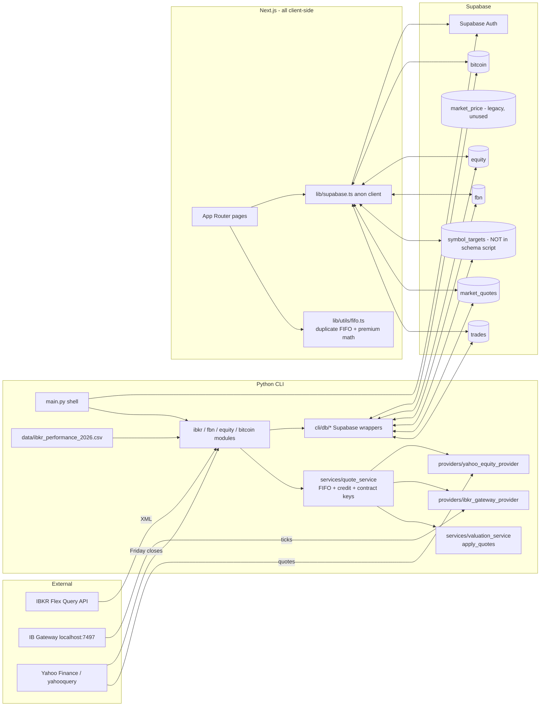

# TradeTools / Operator — Codebase Audit (Phase 1: Discovery)

Date: 2026-06-11
Scope: full repository at `~/projects/operator` (branch `main`, clean tree).
This document is descriptive only — no code has been changed.

---

## 1. What this application is

A personal trading/portfolio management app with **two interfaces sharing one Supabase
PostgreSQL database**:

- **CLI** (`cli/`) — Python + Rich terminal app. The original and most feature-complete
  interface. Read/write for all domains.
- **Web** (`web/`) — Next.js 16 App Router app. Mostly a read-only dashboard mirror of
  the CLI's reporting features (FBN entry is the only write path in the web app).

Domains: **IBKR** (trade import, FIFO P&L, mark-to-market, stats), **FBN** (monthly
account snapshots), **Equity** (net-worth snapshots), **Bitcoin** (buy tracking).

---

## 2. Tech stack

| Layer | Stack | Notes |
|---|---|---|
| CLI | Python 3.14 (`.venv`), Rich 15, pandas 3.0.3, requests, yahooquery 2.4.1, **ib-insync 0.9.86**, supabase-py 2.31, python-dotenv, matplotlib | `requirements.txt` is **unpinned** (only `supabase>=2.0.0` has a constraint). `ib-insync` is an **abandoned upstream** (archived after the author's death; community fork is `ib_async`) — the code already anticipates both logger names (`ibkr_gateway_provider.py:23`). |
| Web | Next.js **16.1.4**, React 19.2.3, Tailwind 4, `@supabase/supabase-js` 2.91 | TypeScript strict; `tsc --noEmit` passes. ESLint has 3 errors + 1 warning (§9). `npm audit`: **8 vulnerabilities (4 high, 4 moderate)** incl. advisories against `next` itself fixed in ≥16.2.x (§7). |
| DB | Supabase Postgres, RLS "all access for any authenticated user" on every table | Single-user model. CLI connects with the **service-role key** (bypasses RLS); web uses the anon key + user session. |
| External services | IBKR Flex Query API (trade import), IB Gateway local API (quotes), Yahoo Finance via yahooquery (equity-quote fallback + Friday closes) | |

**Build/test tooling:** none. There are **zero tests** in the repository (no pytest, no
vitest/jest), no Python linter/formatter config, no CI.

---

## 3. Repository inventory (one-line per file)

### Root
| File | Purpose / status |
|---|---|
| `README.md` | Project readme — mostly accurate, but lists web routes that no longer exist (§8). |
| `AGENTS.md` | Detailed AI-agent onboarding doc — predates the quote-service refactor and Bitcoin module; several claims now stale (§8). |
| `CLAUDE.md` | Claude Code instructions — **significantly stale**: describes API routes, hooks, and components that were deleted (§8). |
| `.env` / `.env.example` | Secrets / template. `.env` is untracked (good). |
| `.gitignore` | OK, but `t.bat` is listed yet still **tracked** (added before ignore). |
| `t.bat` | Windows shortcut: run CLI. Tracked. |
| `t.sh` | Linux shortcut: runs CLI with **plaintext email + password + `-p` on argv** — untracked, but a live credential on disk (§7). |
| `package-lock.json` | **Empty stub** (`"packages": {}`) with no root `package.json` — cruft. |
| `.claude/commands/verify.md`, `.claude/settings.local.json` | Claude Code helper command + local permissions. |

### `shared/`
| File | Purpose |
|---|---|
| `config.py` | Loads root `.env`; exposes Supabase, Flex Query, and IB Gateway settings. |
| `supabase_client.py` | Service-role client singleton + `login()`. Also `logout`, `get_session`, `is_authenticated`, `verify_token` — **all unused** (`is_authenticated` is imported by `main.py` but never called). |
| `ibkr_gateway_config.py` | Frozen dataclass wrapping IB Gateway env settings. |

### `cli/`
| File | Purpose |
|---|---|
| `main.py` | App shell: Gruvbox theme, Supabase auth (3 attempts, optional `-l/-p/-m` auto-login), prompt/render loop, module switching. |
| `base_module.py` | `Module` / `SubModule` base classes (command routing, output buffer, status chain). |
| `home_module.py` | Main menu; routes to ibkr/fbn/equity/bitcoin. |
| `tui.py` | Cross-platform raw-key reader + interactive multi-select picker (used by FBN filter). |
| `ibkr_module.py` (2 021 lines) | IBKR god-module: Flex import, position views (8 sort modes, basket, CSP, CSV), trades lists, assigned calls, performance vs. CSV baseline, daily/weekly stats, trade delta/und_price editing. Contains a **dead duplicate** `calculate_pnl()` + `_parse_option_expiry()` (superseded by `services/quote_service.py`). |
| `ibkr_stats_submodule.py` | STATS sub-module: daily/weekly tables (delegates to parent) + matplotlib plots (daily, weekly, cumulative, outstanding premium, CSP exposure). |
| `fbn_module.py` | FBN monthly/yearly stats, asset matrices, account filters, interactive add/edit. |
| `equity_module.py` | Equity entry CRUD, date-select/list, copy-to-new-date, pivot tables. |
| `bitcoin_module.py` | Bitcoin buys CRUD, list, stats report. |
| `quote_refresh.py` | Standalone JSON-emitting entry point around `refresh_mtm_quotes()`; comment says "invoked from the web app" but **nothing in the repo calls it** (open question §10). |
| `data/ibkr_performance_2026.csv` | Year-performance baseline: start value + deposits (real financial data, tracked in git). |

### `cli/db/` — Supabase access, one file per domain
| File | Purpose |
|---|---|
| `ibkr_db.py` | Trades CRUD with camelCase↔snake_case mapping; `symbol_targets` lookups (target %, basket, margin requirements). `save_market_price` / `fetch_latest_market_prices` (legacy `market_price` table) are **dead**. |
| `market_quote_db.py` | `market_quotes` fetch/upsert with stale-preservation logic. |
| `fbn_db.py` | Fetch all; save = **delete-then-insert** on (date, account). |
| `equity_db.py` | CRUD + bulk insert. |
| `bitcoin_db.py` | CRUD. |

### `cli/domain/`, `cli/providers/`, `cli/services/` — the newer quote pipeline
| File | Purpose |
|---|---|
| `domain/contracts.py` | Contract identity: normalizers + `EQ::`/`OPT::` contract keys, typed Equity/Option/Invalid contracts. |
| `domain/quotes.py` | `QuoteRecord` dataclass; mark derivation rules for equities (last→close) and options (mid→last→close). |
| `providers/quote_provider.py` | `QuoteProvider` Protocol + `ProviderStatus`. |
| `providers/ibkr_gateway_provider.py` | ib-insync wrapper: connect, qualify, batch tickers, permission-error capture (10089/10090/10091), status resolution. |
| `providers/yahoo_equity_provider.py` | yahooquery equity quotes (explicitly refuses options). |
| `services/quote_service.py` | **Canonical business logic**: `calculate_pnl` (FIFO), `calculate_credit`, `prepare_trades` (USD.CAD filter + keys), `build_open_contracts`, `refresh_mtm_quotes` (IBKR primary, Yahoo fallback, stale overlay, persist). |
| `services/valuation_service.py` | `apply_quotes` (mtm_price/value, unrealized P&L). `calculate_position_totals` is **never called**. |

### `scripts/`
| File | Purpose / status |
|---|---|
| `supabase_schema.sql` | Full schema + RLS + indexes. **Missing the `symbol_targets` table that both CLI and web query.** |
| `migrations/20260409_add_market_quotes.sql` | market_quotes migration (already merged into schema file). |
| `migrations/20260607_add_bitcoin.sql` | bitcoin table + **seed of 60+ real personal buy records** (tracked in git). |
| `migrate_to_supabase.py` | One-time SQLite→Supabase migration. **Broken**: imports `DB_PATH` from `shared.config`, which no longer defines it. Dead. |

### `web/src/`
| File | Purpose |
|---|---|
| `app/layout.tsx` | Root layout: fonts, theme-init script, Theme/Auth/Error providers. |
| `app/page.tsx` | Client redirect → `/ibkr` or `/login`. |
| `app/login/page.tsx` | Email/password login. |
| `app/manifest.ts` | PWA manifest ("Operator"). |
| `app/(authenticated)/layout.tsx` | Auth guard + Nav + ErrorBanner. |
| `app/(authenticated)/settings/page.tsx` | Theme toggle + logout. |
| `ibkr/page.tsx` | Positions table (sortable) + totals. |
| `ibkr/positions/page.tsx` | Redirect → `/ibkr`. |
| `ibkr/positions/[symbol]/page.tsx` | Position detail: summary + open-options/closing-options/stock tables. |
| `ibkr/stats/daily|weekly/page.tsx` | Realized P&L by day / W-FRI week. |
| `ibkr/option-premium/daily|weekly/page.tsx` | Premium opened/closed + outstanding premium (with SVG chart on daily). |
| `ibkr/pnl/page.tsx`, `ibkr/mtm/page.tsx` | Realized / unrealized P&L per position. |
| `fbn/page.tsx`, `fbn/yearly/page.tsx` | Monthly/yearly stats (USD→CAD conversion inline). |
| `fbn/assets/monthly|yearly/page.tsx` | Asset matrices. |
| `fbn/entry/page.tsx` | **Only web write path**: account picker + value form, delete-then-insert save. (Does not pre-load existing values, unlike CLI.) |
| `equity/page.tsx`, `equity/pivot/page.tsx` | Read-only equity overview + pivots. |
| `bitcoin/page.tsx`, `bitcoin/stats/page.tsx` | Read-only buys list + stats. |
| `components/ui/` | `Button`, `Input`, `Select`, `Spinner`, `Table` (+`NumericCell`). |
| `components/layout/` | `Nav`, `ErrorBanner`, and **three near-identical dropdowns** `IBKRMenu`/`EquityMenu`/`BitcoinMenu`. |
| `components/ibkr/OutstandingPremiumChart.tsx` | Hand-rolled SVG line chart with SMA + hover. |
| `lib/supabase.ts` | Anon-key client singleton (client-side only — `null!` on server) + column mapping. |
| `lib/auth.tsx`, `lib/error-context.tsx`, `lib/theme.tsx` | Auth/session, single-error, theme contexts. |
| `lib/utils/fifo.ts` | **TypeScript re-implementation** of FIFO P&L, credit, contract keys, quote application, premium analytics, position aggregation. |
| `lib/utils/format.ts` | Formatting + `parseAsNY()` timezone workaround (§7.4). |
| `types/index.ts` | Domain types + shared constants (FBN accounts, categories, exchanges — duplicated from Python). |
| `app/apply_mask.py`, `app/icon copy.png`, `app/icon-sample.png`, `app/favicon.ico.bak` | **Icon-generation leftovers / cruft** inside the app source tree (tracked in git). |

---

## 4. Feature inventory

Status legend: **Active** = reachable and working as designed · **Dead** = unreachable/unused · **Drifted** = exists but docs/behavior disagree.

### CLI
| Feature | Commands | Location | Status |
|---|---|---|---|
| Auth (Supabase email/password, auto-login args) | startup, `-l/-p/-m` | `main.py`, `shared/supabase_client.py` | Active |
| Module navigation | `i/f/e/b`, `q`, `qq`, `h` | `home_module.py`, `base_module.py` | Active |
| IBKR trade import (daily/weekly Flex query, XML→upsert) | `i`, `i w` | `ibkr_module.py:533` | Active (prints token-bearing URL — §7.2) |
| MTM refresh (IB Gateway primary, Yahoo equity fallback, options skip/verbose variants) | `m`, `ms`, `mv` | `quote_service.refresh_mtm_quotes` | Active |
| FIFO realized P&L + remaining qty + DTE/DIT | on load | `quote_service.calculate_pnl` | Active (a second, dead copy lives in `ibkr_module.calculate_pnl`) |
| Position lists (MTM/value/symbol/qty/diff/diff%/target/call/put/total-PnL sorts) | `l`,`lm`,`lv`,`ls`,`lq`,`ld`,`ldr`,`lt`,`lc`,`lp`,`lz` | `list_all_positions` | Active |
| Basket grouping / CSP exposure / CSV export | `lb`, `csp`, `csv` | `list_positions_by_basket`, `list_csp`, `list_positions_csv` | Active (CSP hardcodes multiplier 100) |
| Trades lists (7-day/all, opening-options filter) | `t`, `tt`, `t oo`, `tt oo` | `list_all_trades` | Active |
| Assigned calls report (Yahoo Friday close) | `ca` | `list_assigned_calls` | Active |
| Year performance vs. CSV baseline | `pf` | `show_performance`, `_load_performance_reference` | Active (2026-hardcoded CSV) |
| Daily/weekly stats tables | `sd`, `sw` | `stats_daily`, `stats_weekly` | Active (hardcoded 2026-01-05 / 2026-01-09 start) |
| STATS sub-module plots (daily/weekly/cumulative/OP/CSP) | `s` → `d/w/pd/pw/pc/op/pcsp` | `ibkr_stats_submodule.py` | Active (duplicates daily/weekly series logic) |
| Edit trade delta/und_price | `e <n>` after `p <sym>` | `edit_trade` | Active |
| Per-symbol position view | `p <sym>` | `list_position` | Active |
| Debug dump | `deb` | `debug` | Active (debug aid) |
| FBN monthly/yearly stats + asset matrices + filters + entry | `lm/ly/lma/lya/fa/fr/a` | `fbn_module.py` | Active |
| Equity CRUD/copy/pivots | `a/s/l/e/d/c/p` | `equity_module.py` | Active |
| Bitcoin CRUD/list/report | `a/l/r/e/d` | `bitcoin_module.py` | Active |
| Headless quote refresh (JSON output) | `python cli/quote_refresh.py` | `quote_refresh.py` | **Orphaned?** — no in-repo caller (§10 Q1) |
| Margin requirements per symbol | — | `ibkr_db.fetch_symbol_margin_requirements` | **Dead** — fetched into `self.margin_requirements`, never used |
| Legacy market_price persistence | — | `ibkr_db.save_market_price`, `fetch_latest_market_prices` | **Dead** |
| Position totals service | — | `valuation_service.calculate_position_totals` | **Dead** |
| SQLite→Supabase migration | — | `scripts/migrate_to_supabase.py` | **Dead & broken** (imports nonexistent `DB_PATH`) |

### Web
| Feature | Route | Status |
|---|---|---|
| Login / auth guard / logout / theme | `/login`, `(authenticated)`, `/settings` | Active |
| IBKR positions / detail / pnl / mtm / stats / option premium | `/ibkr`, `/ibkr/positions/[symbol]`, `/ibkr/pnl`, `/ibkr/mtm`, `/ibkr/stats/*`, `/ibkr/option-premium/*` | Active (every page refetches all trades and recomputes FIFO client-side — §9) |
| FBN stats / matrices / entry | `/fbn`, `/fbn/yearly`, `/fbn/assets/*`, `/fbn/entry` | Active (entry form does not load existing values; delete-then-insert) |
| Equity overview / pivots | `/equity`, `/equity/pivot` | Active, read-only |
| Bitcoin list / stats | `/bitcoin`, `/bitcoin/stats` | Active, read-only |
| IBKR import / MTM from web | `/api/ibkr/import`, `/api/ibkr/mtm` | **Removed** — documented in CLAUDE.md/README but the `api/` directory no longer exists. Import & MTM are CLI-only now. |
| Trade history page | `/ibkr/trades` | **Removed** (still documented). |
| Equity entry page | `/equity/entry` | **Removed** (still documented). |
| Keyboard navigation / help overlay | `lib/hooks/useKeyboard.ts`, `KeyboardHelp` | **Removed** (still documented; login page still says "Press Enter to sign in", which is fine). |

---

## 5. Architecture & data flow

Key observations:

1. **Derived values are never persisted.** `realized_pnl`, `remaining_qty`, `credit`,
   `mtm_value`, `unrealized_pnl` are recomputed in memory on every load — independently
   in Python and TypeScript.
2. **The finance math exists twice** (Python `quote_service`/`valuation_service` vs.
   TS `lib/utils/fifo.ts`) **plus a third dead copy** (`IBKRModule.calculate_pnl`).
   The two live copies currently agree on FIFO semantics but differ subtly (e.g. TS
   `applyMtmPrices` sets unavailable quotes' `mtm_value` to `null`, Python sets 0;
   TS option-mark application multiplies by multiplier for options only — same as
   Python; sign conventions match).
3. **The web app has no server side at all** — every page is `"use client"` and talks
   to Supabase directly with the user's session. There are no API routes left.
4. **Quote identity** is the `contract_key` (`EQ::SYM` / `OPT::UND::EXPIRY::C|P::STRIKE::MULT`),
   shared by both implementations and the `market_quotes` table.

---

## 6. Database schema (per `scripts/supabase_schema.sql`)

| Table | Purpose | Notes |
|---|---|---|
| `trades` | IBKR trades (PK `trade_id`) | TIMESTAMPTZ `date_time` stores NY-local wall time mislabeled as UTC (§7.4). |
| `market_quotes` | Normalized quotes by `contract_key` | Current MTM source. |
| `market_price` | Legacy symbol→price | Written/read by **dead code only**. Candidate for removal. |
| `fbn` | Monthly account snapshots, UNIQUE(date, account) | Save is delete+insert in both apps. |
| `equity` | Net-worth snapshots | |
| `bitcoin` | Bitcoin buys | Seeded by migration with real data. |
| `symbol_targets` | target %, basket, margin per symbol | **Used by CLI (3 functions) and web (3 pages) but absent from the schema script.** Exists only in the live database. |

RLS: every table allows ALL operations to any authenticated user. The CLI bypasses RLS
entirely via the service-role key.

---

## 7. Configuration, environment variables, secrets

### Inventory
| Location | Keys | Used by |
|---|---|---|
| `.env` (root, untracked) | SUPABASE_URL, **SUPABASE_KEY (service-role)**, SUPABASE_ANON_KEY, IBKR_TOKEN, QUERY_ID_DAILY, QUERY_ID_WEEKLY, IB_GATEWAY_* | CLI via `shared/config.py`. `SUPABASE_ANON_KEY` is loaded but never used by any code. |
| `web/.env.local` (untracked) | NEXT_PUBLIC_SUPABASE_URL, NEXT_PUBLIC_SUPABASE_ANON_KEY, IBKR_TOKEN, QUERY_ID_DAILY | Only the two NEXT_PUBLIC keys are referenced by code. **IBKR_TOKEN / QUERY_ID_DAILY (and the README-documented PYTHON_BIN) are leftovers** from the deleted API routes. |

### Findings (detail in Phase 2, summarized here)
1. **`t.sh` contains a real email + password in plaintext** and passes them via argv
   (visible in `ps`/shell history). Untracked, but it is a live credential sitting in
   the project directory. The `-l/-p` CLI flags themselves are an insecure pattern.
2. **`import_trades` prints the Flex download URL including the IBKR token** to stdout
   (`ibkr_module.py:561`, a bare `print(url_dl)`) — token leaks into terminal
   scrollback/logs.
3. **CLI runs with the service-role key** even though the user authenticates with
   email/password — RLS is decorative for the CLI. Workable for a single-user app,
   but the anon key + session would suffice and remove a powerful secret from the
   laptop.
4. **Timestamp correctness is patched in the view layer**: IBKR NY-local timestamps
   were stored into TIMESTAMPTZ without an offset, so Postgres returns them as UTC and
   the web strips the `Z` and re-parses (`parseAsNY`). The CLI does the equivalent with
   `tz_localize(None)`. The data model itself is wrong; both UIs compensate.
5. Git history is clean: `.env`, `web/.env.local`, `t.sh` were **never committed**.
6. Real personal financial data **is** committed by design: `cli/data/ibkr_performance_2026.csv`
   and the bitcoin seed migration. Fine for a private repo — flagged for awareness.
7. `npm audit`: 8 vulnerabilities — high: `next` 16.1.4 (3 advisories, fixed ≥16.2.x),
   `minimatch`, `flatted` (dev-tooling chains); moderate: `ajv`, `brace-expansion`,
   `postcss`, `ws`. Python deps unpinned, so no lockfile to audit; `ib-insync` is
   unmaintained upstream.

---

## 8. Documentation drift

| Doc | Stale claims |
|---|---|
| `CLAUDE.md` | Describes `/api/ibkr/import`, `/api/ibkr/mtm`, `/ibkr/trades`, `/equity/entry`, `useKeyboard.ts`, `KeyboardHelp` — none exist. Describes MTM as "yahooquery only, market_price table" — superseded by the IB Gateway + market_quotes pipeline. Says positions are tracked via `target_percent` dict from code — it's DB-driven now. No mention of `settings`, option-premium pages, services/providers/domain layers. |
| `README.md` | Route table includes removed `/ibkr/trades` and `/equity/entry`; web env section documents unused `IBKR_TOKEN`, `QUERY_ID_DAILY`, `PYTHON_BIN`. |
| `AGENTS.md` | Predates Bitcoin module, quote pipeline (`services/`, `providers/`, `domain/`, `market_quotes`), and the IBKR module's current layout; claims a "duplicate except block in process_mtm_update" that no longer exists. Its `symbol_targets`-missing-from-schema warning **is still valid**. |
| `web/README.md` | Untouched create-next-app boilerplate. |
| `docs/ibkr-market-data-blueprint.md` | Design doc for the quote pipeline — historical; implementation matches its shape. |

---

## 9. Dead code & cruft summary (confirmed by grep, details above)

**Python**
- `cli/ibkr_module.py`: `calculate_pnl()` method (~100 lines) and `_parse_option_expiry()` — superseded by `quote_service`; never called.
- `cli/ibkr_module.py:58`: `self.margin_requirements` loaded, never read.
- `cli/db/ibkr_db.py`: `save_market_price`, `fetch_latest_market_prices`.
- `cli/services/valuation_service.py`: `calculate_position_totals`.
- `shared/supabase_client.py`: `logout`, `get_session`, `is_authenticated`, `verify_token` (and the `is_authenticated` import in `main.py`).
- `shared/config.py`: `SUPABASE_ANON_KEY` (loaded, unused).
- `scripts/migrate_to_supabase.py`: broken import (`DB_PATH`), one-time script already executed.
- `cli/quote_refresh.py`: no in-repo caller (pending Q1).

**Web / repo**
- `web/src/app/apply_mask.py`, `icon copy.png`, `icon-sample.png`, `favicon.ico.bak` — icon-generation leftovers inside `src/app/`.
- Root `package-lock.json` — empty stub, no root package.json.
- `web/tsconfig.tsbuildinfo` — build artifact on disk (untracked, should be ignored).
- `cli/__pycache__/`, `shared/__pycache__/` on disk (ignored, fine).
- `web/.gitignore`'d `market_price` references in docs.
- Unused import: `Select` in `fbn/entry/page.tsx` (lint warning).
- Three copy-pasted dropdown menus (`IBKRMenu`/`EquityMenu`/`BitcoinMenu`) differing only in items/aria-label.
- Web pages share a verbatim ~25-line sort handler + fetch/process boilerplate across 6+ pages.

**Lint (current output)**: `react-hooks/set-state-in-effect` error in `lib/theme.tsx`; two `prefer-const` errors (`fifo.ts:72`, `format.ts:39`); unused `Select` warning.

---

## 10. Open questions — could not be determined from code alone

**Please answer these before I proceed to Phase 2/3.**

1. **`cli/quote_refresh.py`** — its header says "invoked from the web app", but no code
   in the repo calls it and the web API routes are gone. Is it invoked by anything
   external today (cron, systemd timer, a deployed server)? If not, should it stay as a
   headless utility or be deleted?
2. **`market_price` table** — only dead code references it. Is anything outside this
   repo still reading it? May I drop the table and its accessors?
3. **`symbol_targets`** — used everywhere but missing from `supabase_schema.sql`. Can
   you confirm its live schema (columns: `symbol`, `target_percent`, `basket`,
   `margin_requirements`, anything else? PK?) so I can add the missing DDL/migration?
4. **`margin_requirements`** — fetched by the CLI but never used. Leftover from a
   removed feature, or groundwork for a planned one (keep) ?
5. **Web env leftovers** — `IBKR_TOKEN`, `QUERY_ID_DAILY` (and documented `PYTHON_BIN`)
   in `web/.env.local` are unused since the API routes were removed. Was removing
   web-side import/MTM intentional and permanent (i.e., import/MTM stay CLI-only)?
6. **Deployment** — is the web app deployed anywhere (e.g., Vercel) or only run on
   localhost? This decides how urgent the Next.js advisories and the auth model are.
7. **Hardcoded 2026 dates** (`2026-01-05`, `2026-01-09`, `ibkr_performance_2026.csv`,
   "starting net liquidation value") — intentional "this year's tracking" convention
   that resets annually, or should these become configuration?
8. **`t.sh` plaintext credentials** — may I delete it / replace it with an approach that
   doesn't store the password in a file or argv (e.g., env var or keyring)? Related:
   keep or drop the `-p/--password` CLI flag?
9. **FBN delete-then-insert** (CLI + web) instead of a true upsert on (date, account) —
   any reason it must stay this way, or may I switch to `upsert`? (Behavior change:
   the row `id` would stop changing on every save.)
10. **Tests** — no test infrastructure exists. For Phase 4 I plan to add `pytest` (CLI)
    and `vitest` (web) as dev-dependencies for characterization tests of the FIFO and
    aggregation logic. OK to introduce these two dev-only dependencies?
